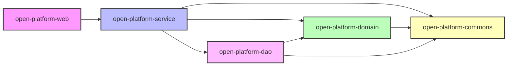

# [需求名称] 技术设计文档

---
**文档元信息**
- 需求名称：[名称]
- PRD 来源：[链接或"对话输入"]
- 生成时间：[时间]
- 项目路径：[路径]
- 技术栈：[基于代码分析]
- 模板类型：综合模板
- 文档版本：v1.0
---

## 目录
- [1. 需求概述](#1-需求概述)
- [2. 约束条件](#2-约束条件)
- [3. 架构设计](#3-架构设计)
- [4. 关键设计点](#4-关键设计点)
- [5. 接口设计](#5-接口设计)
- [6. 非功能需求](#6-非功能需求)
- [7. 风险点与待确认项](#7-风险点与待确认项)
- [8. 监控与告警](#8-监控与告警)
- [9. 开发排期](#9-开发排期)
- [附录](#附录)

---

## 1. 需求概述

### 1.1 背景与价值
**背景**：[从 PRD 提取的项目背景]

**业务价值**：
- [价值点1]
- [价值点2]

**目标用户**：[目标用户群体]

### 1.2 核心功能
| 功能模块 | 功能描述 | 优先级 |
|---------|---------|--------|
| [模块1] | [描述] | P0/P1/P2 |
| [模块2] | [描述] | P0/P1/P2 |
| [模块3] | [描述] | P0/P1/P2 |

### 1.3 影响范围
**新增模块**：
- [模块路径1]
- [模块路径2]

**修改模块**：

| 功能模块    | 功能描述 | 修改说明 |
|---------|---------|--|
| [模块路径1] | [描述] | 修改说明 |
| [模块路径2] | [描述] | 修改说明 |

**影响系统**：
- [系统1]：[影响说明]
- [系统2]：[影响说明]

### 1.4 澄清记录
> 记录在生成文档前与用户的澄清对话

#### PRD 相关澄清
- **问题 1**：[问题描述]
  - **PRD 原文**："[引用原文]"
  - **疑问点**：[为什么不清楚]
  - **用户答案**：[用户的回答]
  - **设计影响**：[对设计的影响]

#### 技术相关澄清
- **问题 1**：[问题描述]
  - **存量代码现状**：[代码分析结果]
  - **冲突点**：[与需求的冲突]
  - **用户答案**：[用户的决策]
  - **设计方案**：[基于答案的设计]

#### 业务逻辑澄清
- **问题 1**：[问题描述]
  - **缺失信息**：[缺少什么]
  - **用户答案**：[用户的补充]
  - **实现方案**：[如何实现]

---

## 2. 约束条件
**要满足的限制条件，这些条件会对设计有约束作用**

### 2.1 技术约束
- **[约束1]**：[具体限制说明]
- **[约束2]**：[具体限制说明]

### 2.2 业务约束
- **[约束1]**：[具体限制说明]
- **[约束2]**：[具体限制说明]

### 2.3 合规约束
- **[约束1]**：[具体限制说明]
- **[约束2]**：[具体限制说明]

---

## 3. 架构设计

### 3.1 整体架构

#### 系统架构图
[使用不同的颜色标记系统红色标记要修改的系统]**使用PlantUML语法**梳理清晰的系统架构图展示系统之间的交互，

- 实例：
- PlantUML
```
@startuml
skinparam componentStyle rectangle
skinparam backgroundColor #FAFAFA
skinparam component {
  BackgroundColor #E8F4FD
  BorderColor #2980B9
  FontColor #2C3E50
  FontSize 12
}

package "麦当劳系统" {
  [麦当劳商圈推送] as MCD_PUSH
  [麦当劳回调接收] as MCD_CALLBACK
}

package "开放平台 (open-platform)" {
  package "轻量预处理（syncDeliveryMap变更）" #FFF9C4 {
    [McDonaldPoolingController] as CTRL
    [McdPoolingDeliveryRangeService\n✏️ syncDeliveryMap\n仅格式校验+距离计算+落库] as SVC #FFF9C4
    [McdDeliveryRangeNoticeHandler\n✏️ 无论距离都通知群] as NOTICE #FFF9C4
  }

  package "定时任务（新增：含解析+外扩+保存）" #D5F5E3 {
    [🆕 McdPoolingFenceSaveJob\n每天执行\n取记录→WKT分离解析\n→外环外扩→调KA保存] as SAVE_JOB #D5F5E3
  }

  package "回调链路（不修改）" {
    [SupplierFenceConfigChange\nConsumerHandler] as CONSUMER
    [McdPoolingDeliveryRangeService\ndoFenceConfigChangeMessage\n（不修改）] as CALLBACK_SVC
    [McdPoolingCallbackService\n（不修改）] as CB_SVC
  }

  package "数据层" {
    [IMcdPoolingDeliveryRangeInfoDao\n✏️ 新增DAO方法] as DAO #FFF9C4
  }
}

package "KA平台" {
  [/fence/external/save] as KA_SAVE
  [Pulsar围栏变更消息] as KA_MQ
}

database "MySQL" {
  [mcd_pooling_delivery_range_info\n✏️ 仅新增callback_date字段\n不保存坐标信息] as DB #FFF9C4
}

MCD_PUSH --> CTRL
CTRL --> SVC : 1.轻量预处理
SVC --> NOTICE : 2.通知群
SVC --> DB : 3.落库(fenceDistance+callbackDate)

SAVE_JOB --> DB : 4.查待处理记录\n(3天后)
SAVE_JOB --> SAVE_JOB : 5.实时WKT分离解析\n+外环外扩1km
SAVE_JOB --> KA_SAVE : 6.保存围栏
SAVE_JOB --> DB : 7.更新状态

KA_SAVE --> KA_MQ : 8.自动发消息
KA_MQ --> CONSUMER : 9.消费消息
CONSUMER --> CALLBACK_SVC : 10.触发回调
CALLBACK_SVC --> CB_SVC : 11.回调麦当劳
CB_SVC --> MCD_CALLBACK : 12.返回围栏数据
@enduml
```

### 3.2 模块划分

#### 模块职责表
| 模块名称 | 路径 | 职责 | 负责人 |
|---------|------|------|--------|
| [模块1] | src/module1 | [职责说明] | [姓名] |
| [模块2] | src/module2 | [职责说明] | [姓名] |

#### 模块依赖关系

[阅读代码使用红色表示修改模块]**使用Mermaid**梳理清晰模块依赖关系图，展示各模块之间的依赖关系。

- 实例：


### 3.3、核心程序流程图


(复杂业务需要画出核心业务程序流程图，如果是修改业务，请用不同的颜色标注出修改业务的流程点)

示例：根据业务复杂度评估是否需要详细程序流程图，如果修改之前的复杂业务，需要画出流程图，并标出改动点，如果流程过多，分功能拆解到不同的流程图

| 功能点 | 流程图 | 变更形式（新增/修改） | 是否找全引用 | 引用梳理 |
|--------|--------|----------------------|--------------|----------|
|        |        |                      |              |          |

#### 核心流程
[阅读代码使用红色表示修改模块]**使用PlantUML**梳理系统核心流程

- 如有多个流程使用多个图表示
- 实例：
```PlantUML
@startuml
skinparam backgroundColor #FAFAFA
skinparam ActivityBackgroundColor #E8F4FD
skinparam ActivityBorderColor #2980B9

start
:接收麦当劳预生效商圈数据\nMcdPollingDeliveryMapRequest;

:参数校验(batchKey/uscode/coordinate非空);
if (参数为空?) then (是)
  #FFCDD2:返回参数错误;
  stop
else (否)
endif

:查询门店信息\nopenMerchantShopReadProxyService\n.queryMerchantShopV2ByMerchantId();
if (门店不存在?) then (是)
  #FFCDD2:返回 RequestParamOrderShopNo;
  stop
else (存在)
endif

:WKT坐标解析\nWKTPointUtil.extractPointsFromWKT();
if (坐标点为空?) then (是)
  #FFCDD2:返回 POOLING_PARAM_IS_NULL;
  stop
else (非空)
endif

:获取门店经纬度\nsupplierContactService / supplierRpcService;

:计算最大配送距离 maxDistance\nPointDistanceUtil.getMaxDistancePoint();
if (maxDistance <= 0?) then (是)
  #FFCDD2:返回 DELIVERY_RANGE_DISTANCE_ERROR;
  stop
else (否)
endif

partition "=== 本次核心变更区域 ===" {
  #FFF9C4:【变更】移除2-6KM距离范围判断\n不再拦截,始终继续处理;

  #FFF9C4:【变更】通知群(复用noticeDistanceError)\n无论距离是否满足都通知\n由京ME侧关注;

  #FFF9C4:【变更】坐标外扩1km\nJTS Geometry.buffer(expandDistance)\nexpandAndConvertCoordinates();

  #D5F5E3:【新增】落库\nsaveRangeInfo(含外扩坐标JSON)\n+ callback_date = NOW + 3天\n+ fence_distance = maxDistance;

  #FFF9C4:【移除】不再调KA平台保存围栏\n移至定时任务(3天后);
}

:返回 McdPoolingResponse.success();

stop
@enduml
```

---

## 4. 关键设计点

### 4.1 数据储存方案

#### 数据库设计
**描述数据持久化方案，如数据库，ES，HBase等；数据增长量的预估；最高写入TPS，最复杂的查询场景和QPS要求**

### 4.2 表结构设计

#### 4.2.1 表名：`table_name`

**表说明**：[表的用途说明]

**建表语句**：[多服务的情况下调用其他服务是否能满足不创建表]

```sql
CREATE TABLE `table_name` (
  `id` bigint(20) NOT NULL AUTO_INCREMENT COMMENT '主键ID',
  `field1` varchar(100) NOT NULL COMMENT '字段1说明',
  `field2` int(11) DEFAULT '0' COMMENT '字段2说明',
  `field3` json DEFAULT NULL COMMENT 'JSON字段说明',
  `status` tinyint(4) NOT NULL DEFAULT '1' COMMENT '状态：1-有效 0-无效',
  `created_by` bigint(20) NOT NULL COMMENT '创建人ID',
  `created_at` timestamp NOT NULL DEFAULT CURRENT_TIMESTAMP COMMENT '创建时间',
  `updated_by` bigint(20) DEFAULT NULL COMMENT '更新人ID',
  `updated_at` timestamp NOT NULL DEFAULT CURRENT_TIMESTAMP ON UPDATE CURRENT_TIMESTAMP COMMENT '更新时间',
  `deleted` tinyint(1) DEFAULT '0' COMMENT '逻辑删除：0-未删除 1-已删除',
  PRIMARY KEY (`id`),
  UNIQUE KEY `uk_field1` (`field1`) COMMENT '唯一索引',
  KEY `idx_status` (`status`) COMMENT '状态索引',
  KEY `idx_created_at` (`created_at`) COMMENT '创建时间索引'
) ENGINE=InnoDB DEFAULT CHARSET=utf8mb4 COMMENT='表注释';
```

**字段说明**：

| 字段名 | 类型 | 是否必填 | 默认值 | 说明 | 示例值 |
|--------|------|----------|--------|------|--------|
| id | bigint(20) | 是 | AUTO | 主键ID | 1 |
| field1 | varchar(100) | 是 | - | 字段1说明 | "value" |
| field2 | int(11) | 否 | 0 | 字段2说明 | 100 |
| status | tinyint(4) | 是 | 1 | 状态枚举 | 1 |

**字段枚举值**：
- `status`：
  - `1`：有效
  - `0`：无效

### 4.2.2 索引设计

#### 索引列表
| 索引名 | 索引类型 | 字段 | 用途 | 预估 Cardinality |
|--------|---------|------|------|-----------------|
| PRIMARY | 主键 | id | 主键查询 | - |
| uk_field1 | 唯一索引 | field1 | 唯一性约束 | 100万 |
| idx_status | 普通索引 | status | 状态过滤 | 2 |
| idx_created_at | 普通索引 | created_at | 时间范围查询 | 100万 |

#### 索引优化建议
1. [优化建议1]
2. [优化建议2]


### 4.3 配置设计
#### 4.3.1 bizConfig配置
| 配置key | 配置说明 | value |
|--------|---------|-------|
| callbackDelayDate | 回传延迟时间(天) | 3     |
| defaultMaxDeliveryDistance | 默认配送最大距离（米），默认10000米(10km) | 10000 |

#### 4.3.2 apollo配置(**配置所属的应用服务**)
| 配置key                         | 配置说明 | value |
|-------------------------------|---------|-------|
| callback_delay_date           | 回传延迟时间(天) | 3     |
| default_max_delivery_distance | 默认配送最大距离（米），默认10000米(10km) | 10000 |

- 不涉及配置的话，4.3.1和4.3.2也需要有表格，不过内容是空的；不要省略掉；

### 4.4 高可用设计
**非必写**：

#### 单点风险避免
| 模块 | 风险点 | 应对方案 | 故障转移时间 |
|------|--------|----------|-------------|
| [模块1] | [风险] | [方案] | [时间] |

#### 系统薄弱点分析
1. **[薄弱点1]**：
- **风险描述**：[详细描述]
- **影响评估**：[评估结果]
- **应急预案**：[预案详情]
- **恢复时间**：[RTO/RPO]

#### 上下游交互保护

| 交互方 | QPS保护 | 缓存策略 | 异常自适应 |
|--------|---------|----------|------------|
| [上游1] | [限流值] | [缓存时间] | [自适应方案] |
| [下游1] | [限流值] | [重试策略] | [降级方案] |

### 4.5 复用性和扩展性设计
- 不涉及跳过4.4展示空

#### 可复用模块
| 模块名称 | 复用场景 | 接入方式 | 扩展点 |
|----------|----------|----------|--------|
| [模块1] | [场景] | [方式] | [扩展点] |

#### 个性化扩展支持
1. **配置化扩展**：[方案说明]
2. **插件化扩展**：[方案说明]
3. **多租户支持**：[方案说明]

### 4.6 安全性设计
- 不涉及跳过4.5展示空
- 不涉及跳过4.6展示空


#### 认证授权方案
| 安全要素 | 实施方案 | 安全等级 | 备注 |
|----------|----------|----------|------|
| 用户认证 | [JWT/OAuth/Session] | [等级] | [说明] |
| 接口鉴权 | [方案] | [等级] | [说明] |
| 数据权限 | [RBAC/ACL] | [等级] | [说明] |

#### 敏感数据保护
| 数据类型 | 保护方案 | 加密算法 | 密钥管理 |
|----------|----------|----------|----------|
| [数据1] | [加密/脱敏] | [算法] | [管理方式] |

---

## 5. 接口设计

### 5.1 接口调用关系

#### 时序图

[涉及改动请用不同颜色标识]**使用PlantUML创建**详细的时序图，展示系统之间的完整交互流程，包括订单创建、状态更新等关键环节。


#### 依赖服务
| 服务名称 | 接口 | 用途 | 超时时间 | 重试次数 |
|---------|------|------|---------|---------|
| [服务1] | [接口] | [用途] | 3s | 3 |
| [服务2] | [接口] | [用途] | 5s | 2 |


### 5.2 接口总览

#### 接口列表
| 序号 | 接口名称 | 方法 | 路径 | 说明 | 权限 |
|-----|---------|------|------|------|------|
| 1 | [接口名] | GET | /api/v1/resource | 查询列表 | user |
| 2 | [接口名] | POST | /api/v1/resource | 创建资源 | admin |
| 3 | [接口名] | PUT | /api/v1/resource/{id} | 更新资源 | admin |
| 4 | [接口名] | DELETE | /api/v1/resource/{id} | 删除资源 | admin |

### 5.3 接口详情

#### 5.3.1 [接口名称1]

**接口说明**：[接口的详细描述]

**请求信息**：

```http
GET /api/v1/resource?page=1&size=10
Authorization: Bearer {token}
```

**请求参数**：

| 参数名 | 类型 | 位置 | 必填 | 说明 | 示例值 |
|--------|------|------|------|------|--------|
| page | int | query | 否 | 页码，默认1 | 1 |
| size | int | query | 否 | 每页条数，默认10 | 10 |
| keyword | string | query | 否 | 搜索关键词 | "test" |

**响应参数**：
```json
{
  "code": 0,
  "message": "success",
  "data": {
    "total": 100,
    "page": 1,
    "size": 10,
    "list": [
      {
        "id": 1,
        "name": "示例名称",
        "status": 1,
        "created_at": "2024-01-01 00:00:00"
      }
    ]
  }
}
```

**响应字段说明**：

| 字段名 | 类型 | 说明 |
|--------|------|------|
| code | int | 响应码，0表示成功 |
| message | string | 响应消息 |
| data.total | int | 总记录数 |
| data.list | array | 数据列表 |

**异常处理**：

| 场景 | HTTP状态码 | 业务码 | 错误消息 |
|-----|-----------|--------|---------|
| 参数错误 | 400 | 10001 | 参数校验失败 |
| 未授权 | 401 | 10002 | 未登录或token过期 |
| 无权限 | 403 | 10003 | 无访问权限 |
| 系统错误 | 500 | 10000 | 系统异常 |

**调用示例**：

```bash
curl -X GET "https://api.example.com/api/v1/resource?page=1&size=10" \
  -H "Authorization: Bearer your_token_here"
```

#### 5.3.2 [接口名称2]
[同上格式]

### 5.4 JSF接口文档（如适用）

#### 5.4.1 [JSF接口名称]

**JSF接口地址**：`com.jd.xxx.service#methodName`

**预发别名**：[别名]
**预发token**：[token]

**生产别名**：[别名]
**生产token**：[token]

**入参**：

| 字段名 | 类型 | 必填 | 描述 | 示例 |
|--------|------|------|------|------|
| [字段1] | [类型] | [是否] | [描述] | [示例] |

**出参**：

| 字段名 | 类型 | 描述 |
|--------|------|------|
| [字段1] | [类型] | [描述] |

**入参示例**：
```json
{
  "field1": "value1",
  "field2": "value2"
}
```

**出参示例**：
```json
{
  "success": true,
  "code": "200",
  "message": "success",
  "result": {}
}
```
---

## 6. 非功能需求

### 6.1 安全设计

#### 认证方案（基于存量代码）
- **认证方式**：[JWT/Session/OAuth]
- **Token 有效期**：[时间]
- **刷新机制**：[方案]

#### 授权方案
- **权限模型**：[RBAC/ACL]
- **权限粒度**：[接口级/数据级]
- **权限校验**：[校验方式]

#### 数据安全
- **敏感数据加密**：[加密字段列表]
- **SQL注入防护**：[使用ORM/参数化查询]
- **XSS防护**：[输入过滤/输出编码]

#### 接口安全
- **限流策略**：[限流规则]
- **防重放攻击**：[timestamp + nonce]
- **签名验证**：[签名算法]

### 6.2 可用性设计

#### 降级策略
| 降级场景 | 触发条件 | 降级方案 | 影响范围 |
|---------|---------|---------|---------|
| [场景1] | [条件] | [方案] | [影响] |

#### 熔断策略
| 服务 | 熔断条件 | 熔断时长 | 恢复策略 |
|-----|---------|---------|---------|
| [服务1] | [条件] | [时长] | [策略] |

#### 容灾方案
- **数据备份**：[备份策略]
- **故障转移**：[转移方案]
- **监控告警**：[监控指标]

### 6.3 资源成本预估

#### 硬件成本
| 资源类型 | 配置要求 | 数量 | 预估成本 | 备注 |
|----------|----------|------|----------|------|
| [服务器] | [配置] | [数量] | [成本] | [说明] |
| [数据库] | [配置] | [数量] | [成本] | [说明] |

#### 软件成本
| 软件类型 | 许可费用 | 数量 | 年费 | 备注 |
|----------|----------|------|------|------|
| [软件1] | [费用] | [数量] | [年费] | [说明] |

### 6.4 其他
**基于实际业务场景技术解决方案**

---


## 7. 风险点与待确认项


### 7.1 技术风险

| 风险点 | 风险等级 | 影响范围 | 应对方案 | 负责人 |
|--------|---------|---------|---------|--------|
| [风险1] | 高 | [影响] | [方案] | [姓名] |
| [风险2] | 中 | [影响] | [方案] | [姓名] |

**详细说明**：
- **[风险1]**：
  - 风险描述：[详细描述]
  - 影响评估：[影响评估]
  - 应对方案：[详细方案]
  - 应急预案：[预案]

### 7.2 业务风险

| 风险点 | 风险等级 | 影响范围 | 应对方案 | 负责人 |
|--------|---------|---------|---------|--------|
| [风险1] | 中 | [影响] | [方案] | [姓名] |


## 8. 监控与告警

#### 关键监控指标
| 指标名称 | 说明 | 告警阈值 | 处理方案 |
|---------|------|---------|---------|
| [指标1] | [说明] | [阈值] | [处理] |
| [指标2] | [说明] | [阈值] | [处理] |

#### 告警级别定义
- **P0（紧急）**：[定义和处理要求]
- **P1（严重）**：[定义和处理要求]
- **P2（一般）**：[定义和处理要求]

#### 告警级别定义
- **[关键字告警]**：
  - 对于打印的日志,配置对应的关键字告警 -
---

## 9. 开发排期

### 9.1 任务拆解

| 阶段 | 任务 | 子任务 | 预估工时 | 负责人 | 依赖 |
|-----|------|--------|---------|--------|------|
| 设计 | 技术方案设计 | 接口设计 | 1d | [姓名] | - |
| 开发 | 后端开发 | 接口实现 | 3d | [姓名] | 设计完成 |
| 测试 | 单元测试 | 测试用例 | 1d | [姓名] | 开发完成 |
| 部署 | 上线部署 | 环境配置 | 0.5d | [姓名] | 测试通过 |

### 9.2 里程碑

| 里程碑 | 时间点 | 交付物 | 负责人 |
|--------|--------|--------|--------|
| 设计评审 | [日期] | 技术设计文档 | [姓名] |
| 开发完成 | [日期] | 功能代码 | [姓名] |
| 测试完成 | [日期] | 测试报告 | [姓名] |
| 上线发布 | [日期] | 生产环境 | [姓名] |


---

## 附录

### A. 术语表
| 术语 | 说明 |
|-----|------|
| [术语1] | [说明] |

### B. 领域术语
| 领域 | 术语 | 说明 |
|------|-----|------|
| [领域1] | [术语1] | [说明] |

### C. 参考资料
- [PRD 文档链接]
- [相关技术文档]
- [接口文档链接]


### E. 变更记录
| 版本 | 日期 | 修改人 | 修改内容 |
|-----|------|--------|---------|
| v1.0 | [日期] | [姓名] | 初始版本 |

---
**文档生成信息**
- 生成工具：prd-to-tech-design skill
- 最后更新：[时间]
- 维护者：[负责人]
- 审核状态：待审核
- 使用模板：[当前使用模板]