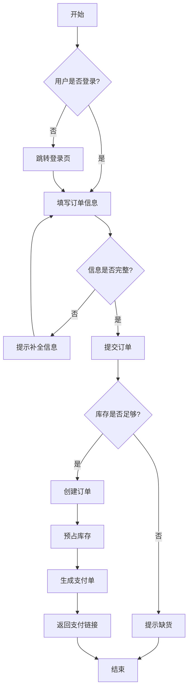
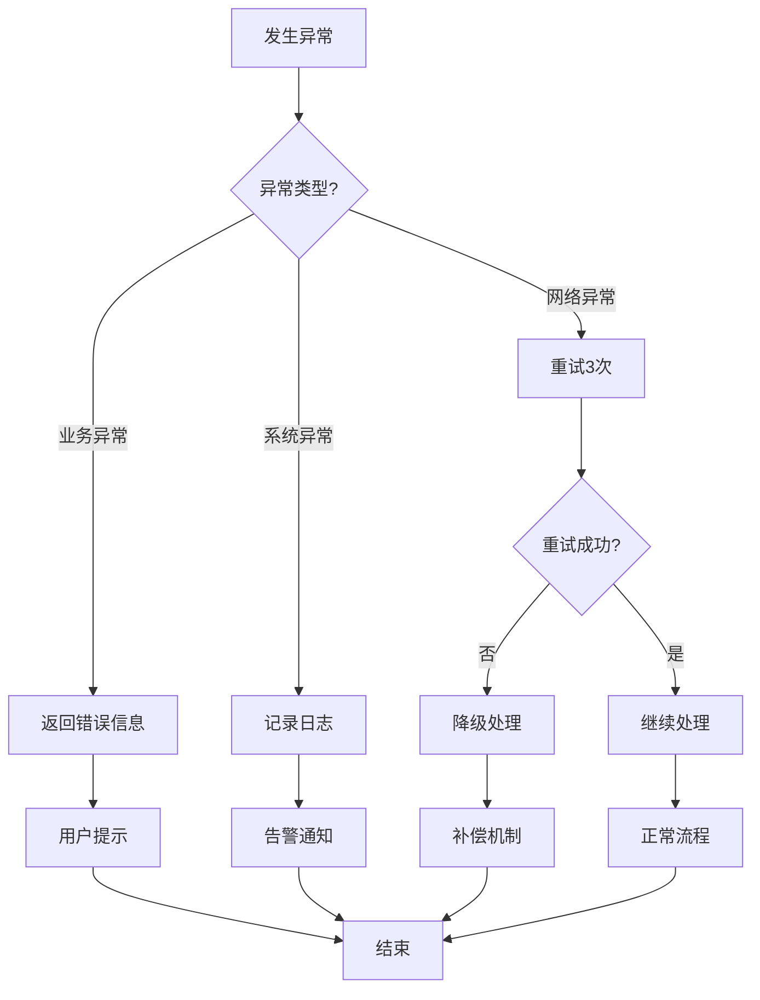
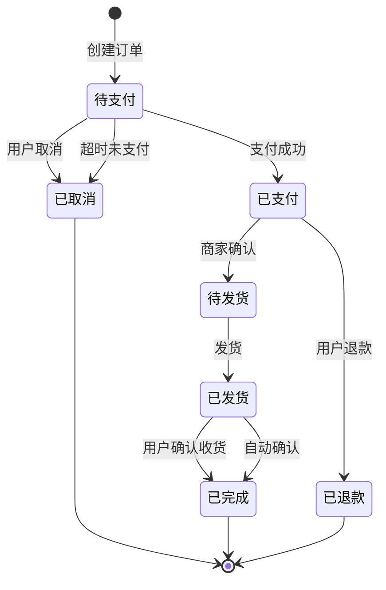
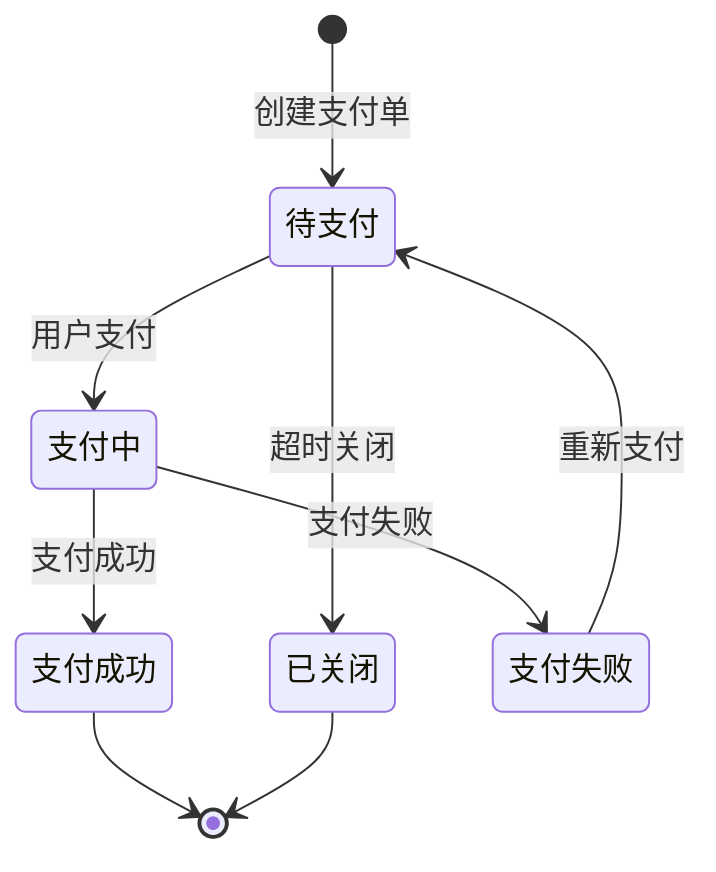
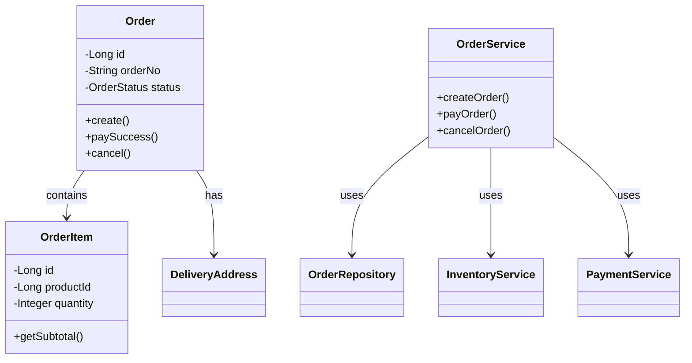

# [需求名称] 技术设计文档（详细版）

---
**文档元信息**
- 需求名称：[名称]
- PRD 来源：[链接或"对话输入"]
- 生成时间：[时间]
- 项目路径：[路径]
- 技术栈：[基于代码分析]
- 模板类型：详细模板
- 文档版本：v1.0
- 复杂度：高
---

> **说明**：本文档基于标准模板，额外增加了详细设计章节（第8章），包含时序图、流程图、状态机设计和详细类设计。

## 目录
- [1-7 章：同标准模板](#1-需求概述)
- [8. 详细设计](#8-详细设计)
  - [8.1 时序图](#81-时序图)
  - [8.2 流程图](#82-流程图)
  - [8.3 状态机设计](#83-状态机设计)
  - [8.4 详细类设计](#84-详细类设计)
  - [8.5 设计模式应用](#85-设计模式应用)
- [9. 常见问题与故障排查](#9-常见问题与故障排查)
- [10. 开发排期](#10-开发排期)
- [11. 附录](#11-附录)

---

## 1-7 章

> 内容同 `standard.md`，此处省略...

---

## 8. 详细设计

### 8.1 时序图

#### 8.1.1 核心业务流程时序图

**场景**：[场景描述，如：用户下单流程]

```
用户          前端应用       API网关      订单服务      库存服务      支付服务
 │              │              │              │              │              │
 │──1.提交订单─>│              │              │              │              │
 │              │──2.认证────>│              │              │              │
 │              │              │──3.创建订单─>│              │              │
 │              │              │              │──4.检查库存─>│              │
 │              │              │              │<─5.库存足够─│              │
 │              │              │              │──6.预占库存─>│              │
 │              │              │              │<─7.预占成功─│              │
 │              │              │              │──8.调用支付────────────────>│
 │              │              │              │<─9.支付链接────────────────│
 │              │<─10.返回链接─│<─11.返回链接─│              │              │
 │<─12.跳转支付─│              │              │              │              │
 │──13.支付────>│              │              │              │              │
 │              │──14.支付回调─>│              │              │              │
 │              │              │──15.更新订单─>│              │              │
 │              │              │              │──16.扣减库存─>│              │
 │              │              │              │<─17.扣减成功│              │
 │              │<─18.支付成功─│<─19.更新成功─│              │              │
 │<─20.订单完成─│              │              │              │              │
```

**步骤说明**：
| 步骤 | 操作 | 说明 | 超时时间 | 失败处理 |
|-----|------|------|---------|---------|
| 1 | 提交订单 | 用户提交订单信息 | - | - |
| 2 | 认证 | 网关验证用户身份 | 100ms | 返回401 |
| 3 | 创建订单 | 创建订单记录（待支付状态） | 200ms | 返回500 |
| 4 | 检查库存 | 查询商品库存 | 300ms | 返回缺货 |
| 5-7 | 预占库存 | 冻结库存数量 | 500ms | 释放订单 |
| 8-11 | 创建支付 | 获取支付链接 | 1s | 释放库存+订单 |
| 13-20 | 支付确认 | 异步回调更新 | - | 补偿机制 |

#### 8.1.2 异常场景时序图

**场景**：[场景描述，如：支付超时处理]

```
用户          订单服务      库存服务      支付服务      定时任务
 │              │              │              │              │
 │──1.支付────>│              │              │              │
 │              │──2.创建支付─>│              │              │
 │              │              │              │──3.等待────>│
 │              │              │              │<─4.超时─────│
 │              │              │              │──5.关闭支付─>│
 │              │<─6.支付失败─│              │              │
 │              │──7.释放库存─>│              │              │
 │              │<─8.释放成功─│              │              │
 │              │──9.取消订单─>│              │              │
 │<─10.订单取消─│              │              │              │
```

### 8.2 流程图

#### 8.2.1 主业务流程图



#### 8.2.2 异常处理流程图



### 8.3 状态机设计

#### 8.3.1 订单状态机



**状态说明**：
| 状态 | 状态码 | 说明 | 可转换状态 |
|-----|--------|------|-----------|
| 待支付 | 10 | 订单已创建，等待支付 | 已支付、已取消 |
| 已支付 | 20 | 支付成功，等待发货 | 待发货、已退款 |
| 待发货 | 30 | 商家已确认，等待发货 | 已发货 |
| 已发货 | 40 | 商家已发货 | 已完成 |
| 已完成 | 50 | 订单完成 | - |
| 已取消 | 60 | 订单取消 | - |
| 已退款 | 70 | 订单退款 | - |

**状态转换规则**：
| 当前状态 | 目标状态 | 触发条件 | 操作 |
|---------|---------|---------|------|
| 待支付 | 已支付 | 支付成功回调 | 更新支付时间 |
| 待支付 | 已取消 | 用户主动取消 | 释放库存 |
| 待支付 | 已取消 | 30分钟未支付 | 释放库存 |
| 已支付 | 待发货 | 商家确认 | 发送通知 |
| 已支付 | 已退款 | 用户申请退款 | 退款处理 |
| 待发货 | 已发货 | 商家发货 | 更新物流信息 |
| 已发货 | 已完成 | 用户确认收货 | 订单完成 |
| 已发货 | 已完成 | 7天自动确认 | 订单完成 |

#### 8.3.2 支付状态机



### 8.4 详细类设计

#### 8.4.1 领域模型

```java
/**
 * 订单聚合根
 * 负责订单的生命周期管理
 */
@Entity
@Table(name = "orders")
public class Order {
    @Id
    @GeneratedValue(strategy = GenerationType.IDENTITY)
    private Long id;

    @Column(name = "order_no", nullable = false, unique = true, length = 32)
    private String orderNo; // 订单编号

    @Column(name = "user_id", nullable = false)
    private Long userId; // 用户ID

    @Column(name = "status", nullable = false)
    @Enumerated(EnumType.ORDINAL)
    private OrderStatus status; // 订单状态

    @Column(name = "total_amount", nullable = false, precision = 10, scale = 2)
    private BigDecimal totalAmount; // 订单总金额

    @Column(name = "pay_amount", nullable = false, precision = 10, scale = 2)
    private BigDecimal payAmount; // 实付金额

    @OneToMany(mappedBy = "order", cascade = CascadeType.ALL, fetch = FetchType.LAZY)
    private List<OrderItem> items; // 订单项

    @Embedded
    private DeliveryAddress deliveryAddress; // 收货地址

    @Column(name = "created_at", nullable = false, updatable = false)
    private LocalDateTime createdAt;

    @Column(name = "paid_at")
    private LocalDateTime paidAt;

    @Column(name = "delivered_at")
    private LocalDateTime deliveredAt;

    @Column(name = "completed_at")
    private LocalDateTime completedAt;

    // 业务方法
    /**
     * 创建订单
     */
    public static Order create(Long userId, List<OrderItem> items, DeliveryAddress address) {
        Order order = new Order();
        order.orderNo = generateOrderNo();
        order.userId = userId;
        order.status = OrderStatus.PENDING_PAYMENT;
        order.items = items;
        order.deliveryAddress = address;
        order.totalAmount = calculateTotalAmount(items);
        order.payAmount = order.totalAmount;
        order.createdAt = LocalDateTime.now();
        return order;
    }

    /**
     * 支付成功
     */
    public void paySuccess() {
        if (this.status != OrderStatus.PENDING_PAYMENT) {
            throw new IllegalStateException("订单状态不允许支付");
        }
        this.status = OrderStatus.PAID;
        this.paidAt = LocalDateTime.now();
    }

    /**
     * 取消订单
     */
    public void cancel(String reason) {
        if (this.status != OrderStatus.PENDING_PAYMENT) {
            throw new IllegalStateException("订单状态不允许取消");
        }
        this.status = OrderStatus.CANCELLED;
        // 释放库存逻辑...
    }

    // 私有方法
    private static String generateOrderNo() {
        return "ORD" + System.currentTimeMillis() + RandomStringUtils.randomNumeric(6);
    }

    private static BigDecimal calculateTotalAmount(List<OrderItem> items) {
        return items.stream()
            .map(OrderItem::getSubtotal)
            .reduce(BigDecimal.ZERO, BigDecimal::add);
    }
}

/**
 * 订单项实体
 */
@Entity
@Table(name = "order_items")
public class OrderItem {
    @Id
    @GeneratedValue(strategy = GenerationType.IDENTITY)
    private Long id;

    @ManyToOne(fetch = FetchType.LAZY)
    @JoinColumn(name = "order_id", nullable = false)
    private Order order;

    @Column(name = "product_id", nullable = false)
    private Long productId;

    @Column(name = "product_name", nullable = false, length = 200)
    private String productName;

    @Column(name = "sku_id", nullable = false)
    private Long skuId;

    @Column(name = "quantity", nullable = false)
    private Integer quantity;

    @Column(name = "price", nullable = false, precision = 10, scale = 2)
    private BigDecimal price;

    @Column(name = "subtotal", nullable = false, precision = 10, scale = 2)
    private BigDecimal subtotal;

    public BigDecimal getSubtotal() {
        return this.subtotal;
    }
}

/**
 * 订单状态枚举
 */
public enum OrderStatus {
    PENDING_PAYMENT(10, "待支付"),
    PAID(20, "已支付"),
    PENDING_DELIVERY(30, "待发货"),
    DELIVERED(40, "已发货"),
    COMPLETED(50, "已完成"),
    CANCELLED(60, "已取消"),
    REFUNDED(70, "已退款");

    private final int code;
    private final String description;

    OrderStatus(int code, String description) {
        this.code = code;
        this.description = description;
    }
}
```

#### 8.4.2 服务层设计

```java
/**
 * 订单服务接口
 */
public interface OrderService {
    /**
     * 创建订单
     */
    OrderDTO createOrder(CreateOrderCommand command);

    /**
     * 支付订单
     */
    PaymentDTO payOrder(Long orderId, PayOrderCommand command);

    /**
     * 取消订单
     */
    void cancelOrder(Long orderId, String reason);

    /**
     * 查询订单
     */
    OrderDTO getOrder(Long orderId);

    /**
     * 订单列表
     */
    PageResult<OrderDTO> listOrders(OrderQuery query);
}

/**
 * 订单服务实现
 */
@Service
@Transactional
public class OrderServiceImpl implements OrderService {

    @Autowired
    private OrderRepository orderRepository;

    @Autowired
    private InventoryService inventoryService;

    @Autowired
    private PaymentService paymentService;

    @Autowired
    private EventPublisher eventPublisher;

    @Override
    public OrderDTO createOrder(CreateOrderCommand command) {
        // 1. 参数校验
        validateCreateOrderCommand(command);

        // 2. 检查库存
        boolean stockAvailable = inventoryService.checkStock(command.getItems());
        if (!stockAvailable) {
            throw new BusinessException("库存不足");
        }

        // 3. 创建订单
        Order order = Order.create(
            command.getUserId(),
            command.getItems(),
            command.getDeliveryAddress()
        );

        // 4. 预占库存
        inventoryService.reserveStock(command.getItems());

        // 5. 保存订单
        order = orderRepository.save(order);

        // 6. 发布事件
        eventPublisher.publish(new OrderCreatedEvent(order));

        return OrderDTO.from(order);
    }

    @Override
    public PaymentDTO payOrder(Long orderId, PayOrderCommand command) {
        // 实现支付逻辑...
    }

    // 其他方法实现...
}
```

#### 8.4.3 仓储层设计

```java
/**
 * 订单仓储接口
 */
public interface OrderRepository {
    /**
     * 保存订单
     */
    Order save(Order order);

    /**
     * 根据ID查询
     */
    Optional<Order> findById(Long id);

    /**
     * 根据订单号查询
     */
    Optional<Order> findByOrderNo(String orderNo);

    /**
     * 查询用户订单
     */
    Page<Order> findByUserId(Long userId, Pageable pageable);

    /**
     * 查询待支付订单（用于超时取消）
     */
    List<Order> findPendingPaymentOrders(LocalDateTime before);

    /**
     * 批量更新状态
     */
    int batchUpdateStatus(List<Long> orderIds, OrderStatus newStatus);
}
```

#### 8.4.4 领域事件

```java
/**
 * 订单创建事件
 */
public class OrderCreatedEvent extends DomainEvent {
    private final Long orderId;
    private final Long userId;
    private final BigDecimal totalAmount;
    private final LocalDateTime occurredAt;

    public OrderCreatedEvent(Order order) {
        super();
        this.orderId = order.getId();
        this.userId = order.getUserId();
        this.totalAmount = order.getTotalAmount();
        this.occurredAt = LocalDateTime.now();
    }
}

/**
 * 订单支付成功事件
 */
public class OrderPaidEvent extends DomainEvent {
    private final Long orderId;
    private final String transactionId;
    private final BigDecimal paidAmount;

    public OrderPaidEvent(Order order, String transactionId) {
        super();
        this.orderId = order.getId();
        this.transactionId = transactionId;
        this.paidAmount = order.getPayAmount();
    }
}
```

### 8.5 设计模式应用

| 设计模式 | 应用场景 | 说明 |
|---------|---------|------|
| 工厂模式 | Order.create() | 封装订单创建逻辑 |
| 状态模式 | OrderStatus | 管理订单状态转换 |
| 策略模式 | 支付方式选择 | 不同支付方式的策略实现 |
| 观察者模式 | 事件发布订阅 | 订单状态变更通知 |
| 模板方法 | 通用业务流程 | 定义业务流程骨架 |

---

## 9. 常见问题与故障排查

> 内容同 `standard.md` 第7章，此处省略...

---

## 10. 开发排期

> 内容同 `standard.md` 第8章，此处省略...

---

## 11. 附录

### 11.1 UML 类图



### 11.2 设计决策记录

> 记录重要的技术选型和架构决策

| 决策编号 | 决策内容 | 候选方案 | 选择理由 |
|---------|---------|---------|---------|
| ADR-001 | [决策内容] | 1. [方案A]<br>2. [方案B] | [选择理由] |

### 11.3 技术选型对比

| 技术方案 | 优点 | 缺点 | 最终选择 |
|---------|------|------|---------|
| 方案A | [优点] | [缺点] | ✓ |
| 方案B | [优点] | [缺点] | |

**选择理由**：[详细说明为什么选择方案A]

### 11.4 性能优化建议

1. **数据库优化**
   - [优化建议1]
   - [优化建议2]

2. **缓存策略**
   - [缓存建议1]
   - [缓存建议2]

3. **异步处理**
   - [异步建议1]
   - [异步建议2]

### 11.5 扩展性设计

1. **水平扩展**
   - 无状态服务设计
   - 分库分表策略

2. **功能扩展**
   - 预留扩展点
   - 插件化设计

---
**文档生成信息**
- 生成工具：prd-to-tech-design skill
- 最后更新：[时间]
- 维护者：[负责人]
- 审核状态：待审核
- 详细程度：高
